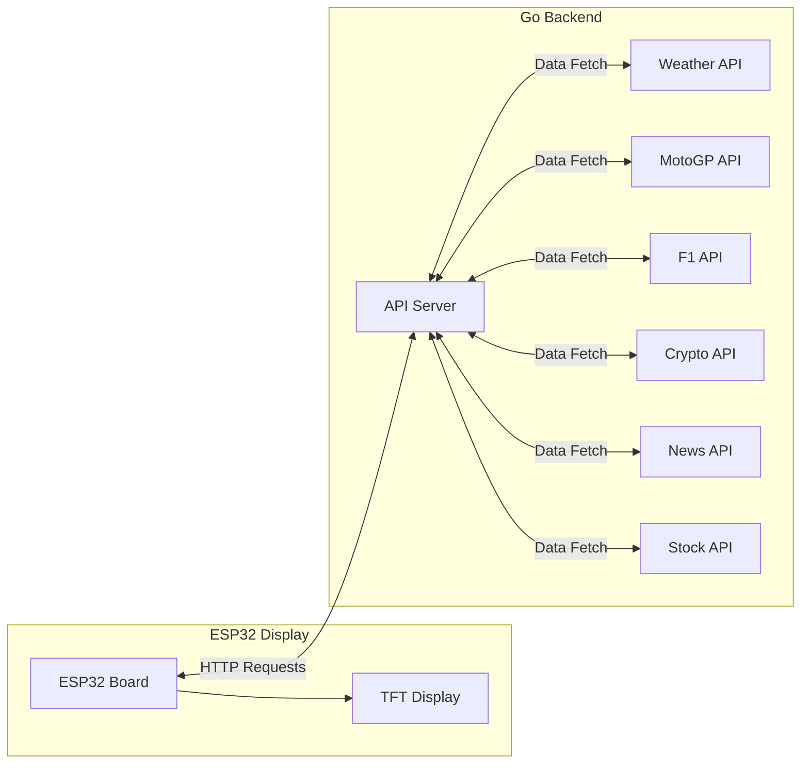

# DaySync

A project that displays MotoGP race calendar, Formula 1 calendar, weather information, cryptocurrency prices, stock market data, and news on an ESP32 with a TFT display.



## Project Structure

- `backend/`: Go API backend
- `esp32/`: ESP32 display code

## Backend Setup

1. Navigate to the backend directory:
```bash
cd backend
```

2. Install dependencies:
```bash
go mod tidy
```

3. Run the server:
```bash
go run main.go
```

The API will be available at `http://localhost:5173/api` with the following endpoints:
- `GET /api/motogp` - Get MotoGP season data
- `GET /api/motogpnextrace` - Get next MotoGP race
- `GET /api/formula1` - Get Formula 1 season data
- `GET /api/formula1nextrace` - Get next Formula 1 race
- `GET /api/weather` - Get weather data for a location
- `GET /api/crypto` - Get cryptocurrency price data
- `GET /api/news` - Get top news headlines
- `GET /api/finance` - Get stock market data

## ESP32 Setup

1. Install required libraries in Arduino IDE:
   - TFT_eSPI
   - ArduinoJson
   - HTTPClient
   - LVGL

2. Configure TFT_eSPI:
   - Edit the `User_Setup.h` file in the TFT_eSPI library
   - Uncomment the correct display configuration for your ESP32 board

3. Update the following in `esp32/src/main.cpp`:
   - WiFi credentials (`ssid` and `password`)
   - API endpoint URL (`BASE_URL`)
   - Location and timezone settings

4. Upload the code to your ESP32

## Hardware Requirements

- ESP32 development board
- TFT display compatible with TFT_eSPI library
- USB cable for programming
- Power supply

## Display Features

The display automatically switches between screens every 10 seconds, showing:

1. Weather Information
   - Location
   - Current date and time
   - Temperature
   - Humidity
   - Weather conditions

2. MotoGP Calendar
   - Race name
   - Circuit
   - Date
   - Next race information

3. Formula 1 Calendar
   - Race name
   - Circuit
   - Date
   - Next race information

4. Stock Market
   - Multiple stock symbols
   - Current price
   - Price change
   - Market data

5. Cryptocurrency
   - Multiple crypto symbols
   - Current price
   - 24h change
   - Market cap

6. News Headlines
   - News title
   - Source
   - Multiple headlines across two screens

7. About Screen
   - Version information
   - Author details
   - GitHub repository link

## Data Refresh

- Weather data: Every 60 minutes
- MotoGP data: Every 60 minutes
- Formula 1 data: Every 60 minutes
- Cryptocurrency data: Every 60 minutes
- News data: Every 60 minutes
- Stock market data: Every 60 minutes

## Configuration

The project can be configured through:
- Backend configuration file (`config.yaml`)
- Environment variables (`api.env`)
- ESP32 source code settings

## Development

The project supports:
- Test mode for development
- ICS to JSON conversion for calendar data
- CORS support for API endpoints
- HTTP caching for improved performance 