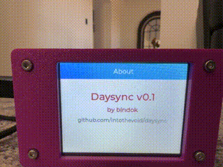
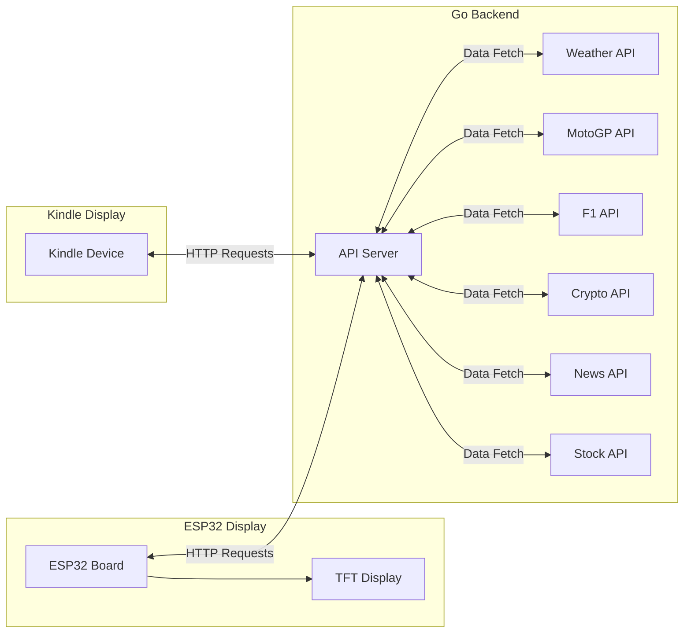

# Daysync



A project that displays weather information, news, cryptocurrency prices, MotoGP / Formula1 calendars and stock market data on an ESP32 with a TFT display. The ESP32-2432S028 is a 2.4" TFT display with a resolution of 240x320 pixels which is perfect for this project.


```mermaid
graph LR
    subgraph ESP32["ESP32 Display"]
        E[ESP32 Board]
        T[TFT Display]
        E --> T
    end

    subgraph Kindle["Kindle Display"]
        K[Kindle Device]
    end

    subgraph Backend["Go Backend"]
        B[API Server]
        W[Weather API]
        M[MotoGP API]
        F[F1 API]
        C[Crypto API]
        N[News API]
        S[Stock API]
    end

    E <-->|HTTP Requests| B
    K <-->|HTTP Requests| B
    B <-->|Data Fetch| W
    B <-->|Data Fetch| M
    B <-->|Data Fetch| F
    B <-->|Data Fetch| C
    B <-->|Data Fetch| N
    B <-->|Data Fetch| S
```

## Project Structure

- `backend/`: Go API backend
- `esp32/`: ESP32 display code
- `kindle/`: Kindle extension code

## Backend Setup

1. Navigate to the backend directory:
```bash
cd backend
```

2. Install dependencies:
```bash
go mod tidy
```

3. Run the server:
```bash
go run main.go
```

The API will be available at `http://localhost:5173/api` with the following endpoints:
- `GET /api/motogp` - Get MotoGP season data
- `GET /api/motogpnextrace` - Get next MotoGP race
- `GET /api/formula1` - Get Formula 1 season data
- `GET /api/formula1nextrace` - Get next Formula 1 race
- `GET /api/weather` - Get weather data for a location
- `GET /api/crypto` - Get cryptocurrency price data
- `GET /api/news` - Get top news headlines
- `GET /api/finance?symbol={symbol}`: Get stock market data for a given symbol

### Kindle Endpoints

- `/kindle/motogp`: Get next MotoGP race as a PNG image.
- `/kindle/formula1`: Get next Formula 1 race as a PNG image.
- `/kindle/weather`: Get weather as a PNG image.
- `/kindle/crypto`: Get crypto prices as a PNG image.
- `/kindle/finance`: Get finance data as a PNG image.
- `/kindle/news`: Get news as a PNG image.

## Kindle

The Kindle extension is a KUAL extension that fetches PNG images from the backend API and displays them on the Kindle screen. The extension cycles through the available endpoints every 5 minutes, refreshing the display with a new image.

### Kindle Setup

1. Copy the `kindle/daysync` directory to the `/mnt/us/extensions/` directory on your Kindle.
2. The extension can be started and stopped from the KUAL menu.
3. A "Refresh" action is also available to manually trigger an update.

## API Documentation

The API documentation is available at `http://localhost:5173/docs/` and provides:

- Interactive Swagger UI interface
- Detailed API endpoint documentation
- Request/response schemas
- Try-it-out functionality for testing endpoints

The documentation is automatically generated from the OpenAPI specification and includes:
- All available endpoints
- Required parameters
- Response formats
- Example requests and responses

## ESP32 Setup

1. Install required libraries in Arduino IDE:
   - TFT_eSPI
   - ArduinoJson
   - HTTPClient
   - LVGL

2. Configure TFT_eSPI:
   - Edit the `User_Setup.h` file in the TFT_eSPI library
   - Uncomment the correct display configuration for your ESP32 board

3. Update the following in `esp32/src/main.cpp`:
   - WiFi credentials (`ssid` and `password`)
   - API endpoint URL (`BASE_URL`)
   - Location and timezone settings

4. Upload the code to your ESP32

## Hardware Requirements

- ESP32 development board
- TFT display compatible with TFT_eSPI library
- USB cable for programming
- Power supply

## Display Features

The display automatically switches between screens every 10 seconds, showing:

1. Weather Information
   - Location
   - Current date and time
   - Temperature
   - Humidity
   - Weather conditions

2. MotoGP Calendar
   - Race name
   - Circuit
   - Date
   - Next race information

3. Formula 1 Calendar
   - Race name
   - Circuit
   - Date
   - Next race information

4. Stock Market
   - Multiple stock symbols
   - Current price
   - Price change
   - Market data

5. Cryptocurrency
   - Multiple crypto symbols
   - Current price
   - 24h change
   - Market cap

6. News Headlines
   - News title
   - Source
   - Multiple headlines across two screens

7. About Screen
   - Version information
   - Author details
   - GitHub repository link

## Data Refresh

- Weather data: Every 60 minutes
- MotoGP data: Every 60 minutes
- Formula 1 data: Every 60 minutes
- Cryptocurrency data: Every 60 minutes
- News data: Every 60 minutes
- Stock market data: Every 60 minutes

## Configuration

The project can be configured through:
- Backend configuration file (`config.yaml`)
- Environment variables (`api.env`)
- ESP32 source code settings

## Development

The project supports:
- Test mode for development
- ICS to JSON conversion for calendar data
- CORS support for API endpoints
- HTTP caching for improved performance
